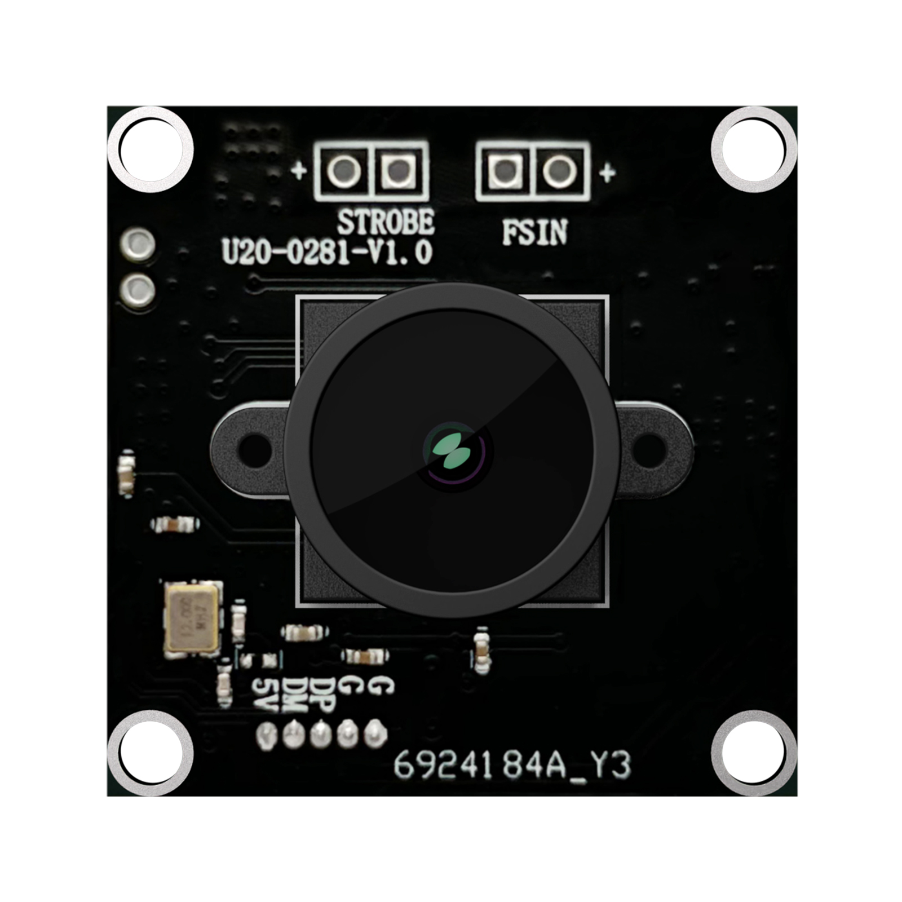

# U20CAM-9281M UserManual

# Features
- U20CAM-9281M is a 1.3Megapixel global shutter uvc camera module by mono sensor ov9281;
- Support plug and play for Windows, Linux, MAC, Android systems with uvc drivers(USB Video Class.);
- Support hardware external trigger mode and live streamming mode; 
- Support maximum  resolution up to 1280x800 at framerate 120fps,default 1280x800 at framerate 30fps.
- Provide hardware connection for external trigger and stobe signal,software setup for extrenal trigger.
- Provide AMCAP,Potplayer,Opencv python samples for window;
- Provide guvcview,v4l utility tools,opencv python,gstreamer,samples;
- MJPG Output resolutions:
  - 1280x800 120fps,30fps,15fps,10fps
  - 1280x720 120fps,60fps,30fps,20fps,15pfs,10fps 
  - 800x600  120fps,60fps,30fps,20fps,15pfs,10fps
  - 640x360  120fps,60fps,30fps,20fps,15pfs,10fps
  - 640x400  120fps,60fps,30fps,20fps,15pfs,10fps
  - 640x480  120fps,60fps,30fps,20fps,15pfs,10fps
  - 320x240  120fps,60fps,30fps,20fps,15pfs,10fps
  - 320x200  120fps,60fps,30fps
- YUY2 Output resolutions:
  - 1280x80  10fps
  - 1280x720 10fps
  - 800x600  10fps
  - 640x400  30fps,20fps,15pfs,10fps
  - 640x480  30fps,20fps,15pfs,10fps
  - 320x240  60fps,30fps,20fps,15pfs,10fps
  - 320x200  60fps,30fps,20fps,15pfs,10fps
# Specification
# Appication
# How to USE
- [Hardware Manual](https://github.com/INNO-MAKER/U20CAM-9281M/blob/main/Manual/U20CAM-9281M-HW-V1.pdf "Hardware Manual")
- [Software Manual](https://github.com/INNO-MAKER/U20CAM-9281M/blob/main/Manual/UVC-SW-Manual-V1.pdf "Software Manual")
# More Information

- (1) OpenCV (opencv-python): OpenCV is an open-source computer vision library that allows easy access to UVC cameras via cv2.VideoCapture. Official documentation link: https://opencv.org/ PyPI installation link: https://pypi.org/project/opencv-python/

- (2) PyUVC: PyUVC is a Python library for accessing UVC cameras that interacts directly with the UVC protocol. GitHub repository: https://github.com/pyuvc/pyuvc PyPI installation link: https://pypi.org/project/pyuvc/

- (3) VideoCapture (Python wrapper for V4L2):If you're working on a Linux system, VideoCapture is a simple interface that allows you to interact with cameras via V4L2. GitHub repository: https://github.com/charlesw/VideoCapture

- (4) libuvc:libuvc is an open-source UVC (USB Video Class) driver that provides APIs to control UVC devices. Python wrappers can be used via ctypes or cffi. GitHub repository: https://github.com/libuvc/libuvc