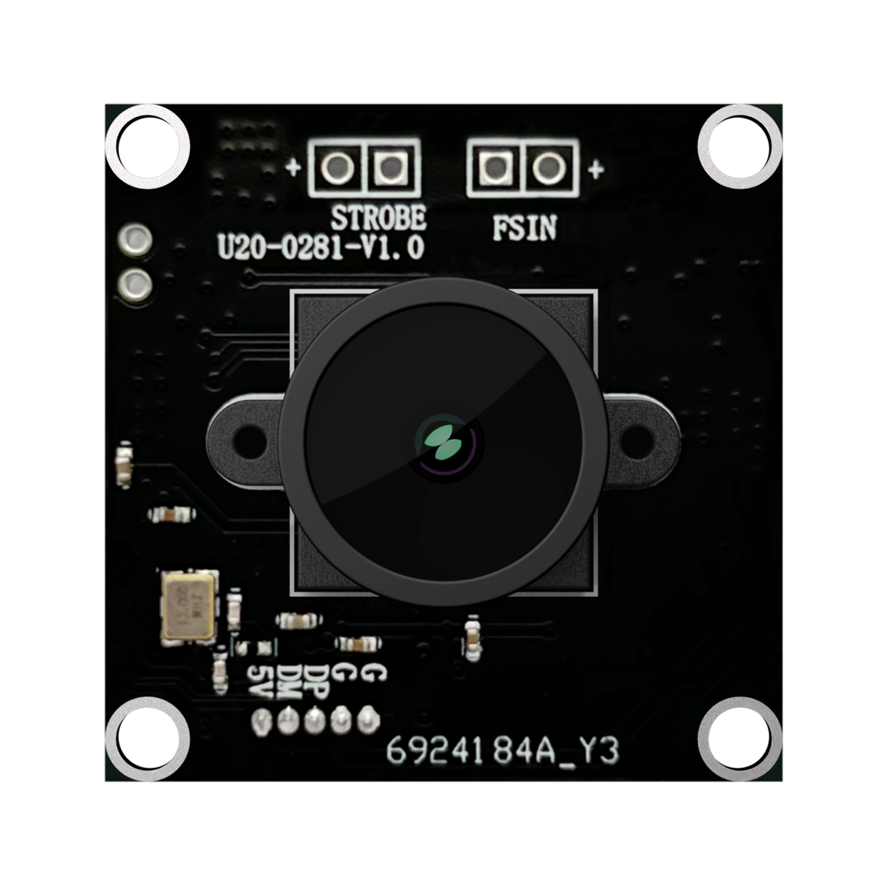

# U20CAM-9281M 1.3MP Global Shutter UVC Camera Module



The **U20CAM-9281M** is a high-performance, 1.3-megapixel monochrome global shutter camera module based on the **OmniVision OV9281** sensor. Designed for high-speed motion capture and machine vision, it features a standard UVC (USB Video Class) interface for driver-free operation across all major operating systems.

---

## Key Features

*   **Global Shutter Technology**: Eliminates rolling shutter distortion, making it ideal for high-speed motion analysis and barcode scanning.
*   **High Frame Rate**: Supports up to **120 fps** at full resolution (1280x800) in MJPG mode.
*   **Plug-and-Play**: Fully compliant with UVC standards. Works out-of-the-box on Windows, Linux, macOS, and Android.
*   **Hardware Trigger & Strobe**: Dedicated headers for external hardware trigger input and strobe output synchronization.
*   **Compact Industrial Design**: USB 2.0 interface, low power consumption, and robust build quality.

---

## Specifications

| Feature | Specification |
| :--- | :--- |
| **Sensor** | OmniVision OV9281 (Monochrome, Global Shutter) |
| **Resolution** | 1280 (H) x 800 (V), 1.3 MP |
| **Pixel Size** | 3.0 µm x 3.0 µm |
| **Optical Size** | 1/4 inch |
| **Interface** | USB 2.0 (UVC Compliant) |
| **Output Formats** | MJPG / YUY2 |
| **Max Frame Rate** | 120 fps @ 1280x800 (MJPG) |
| **Shutter Type** | Global Shutter |
| **Operating Temp** | -20°C to +70°C |

### Supported Resolutions (MJPG)
*   1280x800 @ 120/30/15/10 fps
*   1280x720 @ 120/60/30/20/15/10 fps
*   800x600 @ 120/60/30/20/15/10 fps
*   640x480 @ 120/60/30/20/15/10 fps

---

## Hardware Interface & Trigger

The module provides physical pins for advanced synchronization:
*   **External Trigger**: Allows the camera to capture frames based on an external electrical signal.
*   **Strobe Output**: Provides a signal to synchronize external lighting (e.g., LED flash) with the exposure.

### Trigger Scripts
Example scripts for Raspberry Pi GPIO triggering are included:
*   [`ov9281_trig_sig_pin23.sh`](./ov9281_trig_sig_pin23.sh): Standard GPIO trigger loop.
*   [`ov9281_trig_sig_pin23_trixieos.sh`](./ov9281_trig_sig_pin23_trixieos.sh): Optimized for the latest Raspberry Pi OS (Bookworm/Trixie).

---

## Software & Examples

### Windows
*   **AMCAP**: A simple utility for preview and capture ([`AMCAP2.EXE`](./AMCAP2.EXE)).
*   **PotPlayer**: Recommended for high-frame-rate preview.
*   **Python/OpenCV**: See [`capture.py`](./capture.py) and [`capture2.py`](./capture2.py) for implementation examples.

### Linux
*   **Guvcview / qv4l2**: Standard UVC viewing tools.
*   **V4L2-CTL**: Command-line tool for parameter adjustment.
    ```bash
    v4l2-ctl -d /dev/video0 --list-formats-ext
    ```

---

## Repository Structure

*   [`Images/`](./Images/): Product photos and connection diagrams.
*   [`Manual/`](./Manual/): 
    *   [`U20CAM-9281M-V11.pdf`](./Manual/U20CAM-9281M-V11.pdf): Full technical user manual.
    *   [`sw.md`](./Manual/sw.md): Software setup and UVC protocol guide.
    *   [`CE/FCC Certifications`](./Manual/): Compliance documentation.
*   [`capture.py`](./capture.py) / [`capture2.py`](./capture2.py): Python OpenCV capture samples.
*   [`AMCAP2.EXE`](./AMCAP2.EXE): Windows capture utility.

---

## Support

*   **Website**: [www.inno-maker.com](https://www.inno-maker.com)
*   **Email**: [support@inno-maker.com](mailto:support@inno-maker.com) | [sales@inno-maker.com](mailto:sales@inno-maker.com)
