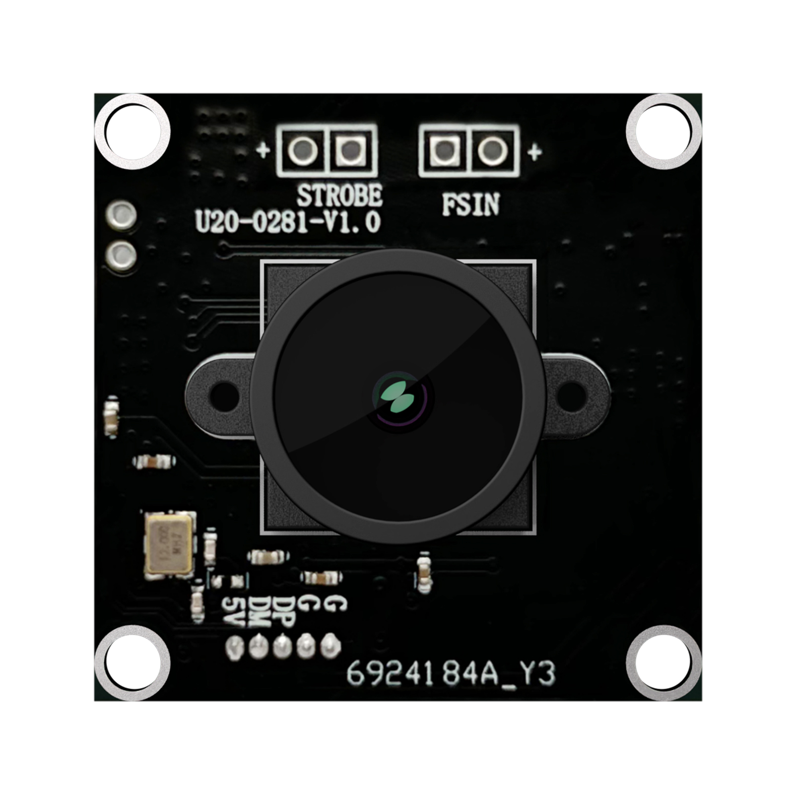

# U20CAM-9281M 1MP Global Shutter UVC Camera Module with External Trigger & Strobe Support



The **U20CAM-9281M** is a high-performance, 1-megapixel monochrome global shutter camera module based on the **OmniVision OV9281** sensor. Designed for high-speed motion capture and machine vision, it features a standard UVC (USB Video Class) interface for driver-free operation across all major operating systems.

---

## Key Features

*   **Global Shutter Technology**: Eliminates rolling shutter distortion, making it ideal for high-speed motion analysis and barcode scanning.
*   **High Frame Rate**: Supports up to **120 fps** at full resolution (1280x800) in MJPG mode.
*   **Plug-and-Play**: Fully compliant with UVC standards. Works out-of-the-box on Windows, Linux, macOS, and Android.
*   **Hardware Trigger & Strobe**: Dedicated headers for external hardware trigger input and strobe output synchronization.
*   **Compact Industrial Design**: USB 2.0 interface, low power consumption, and robust build quality.

---

## Specifications

| Feature | Specification |
| :--- | :--- |
| **Sensor** | OmniVision OV9281 (Monochrome, Global Shutter) |
| **Resolution** | 1280 (H) x 800 (V), 1 MP |
| **Pixel Size** | 3.0 µm x 3.0 µm |
| **Optical Size** | 1/4 inch |
| **Interface** | USB 2.0 (UVC Compliant) |
| **Output Formats** | MJPG / YUY2 |
| **Max Frame Rate** | 120 fps @ 1280x800 (MJPG) |
| **Shutter Type** | Global Shutter |
| **Operating Temp** | -20°C to +70°C |

### Supported Resolutions (MJPG)
*   1280x800 @ 120/30/15/10 fps
*   1280x720 @ 120/60/30/20/15/10 fps
*   800x600 @ 120/60/30/20/15/10 fps
*   640x480 @ 120/60/30/20/15/10 fps

---

## Hardware Interface & Trigger

The module provides physical pins for advanced synchronization:
*   **External Trigger**: Allows the camera to capture frames based on an external electrical signal.
*   **Strobe Output**: Provides a signal to synchronize external lighting (e.g., LED flash) with the exposure.

### Trigger Scripts
Example scripts for Raspberry Pi GPIO triggering are included:
*   [`ov9281_trig_sig_pin23.sh`](./ov9281_trig_sig_pin23.sh): Standard GPIO trigger loop.
*   [`ov9281_trig_sig_pin23_trixieos.sh`](./ov9281_trig_sig_pin23_trixieos.sh): Optimized for the latest Raspberry Pi OS (Bookworm/Trixie).

---

## Software & Examples

### Windows

#### Using AMCAP Utility
*   **AMCAP**: A simple utility for preview and capture ([`AMCAP2.EXE`](./AMCAP2.EXE)).
*   **PotPlayer**: Recommended for high-frame-rate preview.

#### Python/OpenCV on Windows

**Requirements:**
```cmd
pip install opencv-python numpy
```

**Critical: Use DirectShow Backend**

Windows OpenCV defaults to MSMF (Media Foundation), which has very limited UVC control support. You must explicitly request the DirectShow backend:

```python
cap = cv2.VideoCapture(0, cv2.CAP_DSHOW)   # CORRECT
cap = cv2.VideoCapture(0)                  # WRONG (uses MSMF, exposure won't work)
```

**Exposure Value Uses log2(seconds)**

Unlike Linux or macOS, DirectShow uses a logarithmic exposure scale:

| log2 Value | Exposure | Max FPS |
|-----------|----------|---------|
| -5        | 31.25 ms | ~30     |
| -6        | 15.6 ms  | ~60     |
| -7        | 7.8 ms   | ~120    |
| -8        | 3.9 ms   | ~120    |
| -9        | 1.95 ms  | ~120    |
| -10       | 0.98 ms  | -       |

**Quick Start:**
```cmd
# List available cameras
python python_code/windows/u20cam_windows_control.py --list

# Show camera status
python python_code/windows/u20cam_windows_control.py --status

# Stream mode + manual exposure 5ms + gain 32
python python_code/windows/u20cam_windows_control.py --mode stream --exposure-ms 5 --gain 32

# Apply settings + live preview
python python_code/windows/u20cam_windows_control.py --mode stream --exposure-ms 5 --gain 32 --preview
```

See [`python_code/windows/README_windows.md`](./python_code/windows/README_windows.md) for complete documentation.

---

### Linux

#### Using Standard Tools
*   **Guvcview / qv4l2**: Standard UVC viewing tools.
*   **V4L2-CTL**: Command-line tool for parameter adjustment.
    ```bash
    v4l2-ctl -d /dev/video0 --list-formats-ext
    ```

#### Python/OpenCV on Linux

**Requirements:**
```bash
sudo apt install v4l-utils
pip3 install opencv-python numpy
```

**Features:**
- Switch between **Stream Mode** (free-running) and **Trigger Mode** (FSIN-driven)
- Set manual exposure value (in milliseconds)
- Set gain value
- Restore auto exposure
- Live preview to verify settings

**Exposure Time Reference (UVC Standard: 100us units)**

| UVC Value | Exposure Time | Max FPS |
|-----------|---------------|---------|
| 10        | 1 ms          | 1000    |
| 50        | 5 ms          | 200     |
| 83        | 8.3 ms        | ~120    |
| 100       | 10 ms         | 100     |
| 167       | 16.7 ms       | ~60     |
| 333       | 33.3 ms       | ~30     |

**Quick Start:**
```bash
# Show current camera status
python3 python_code/linux/u20cam_linux_control.py --status

# Stream mode with manual exposure 5ms + gain 32
python3 python_code/linux/u20cam_linux_control.py --mode stream --exposure-ms 5 --gain 32

# Switch to trigger mode (waits for external FSIN pulse)
python3 python_code/linux/u20cam_linux_control.py --mode trigger

# Apply settings + live preview
python3 python_code/linux/u20cam_linux_control.py --mode stream --exposure-ms 5 --gain 32 --preview
```

See [`python_code/linux/README_linux.md`](./python_code/linux/README_linux.md) for complete documentation.

---

### macOS

#### Python/OpenCV on macOS

**Requirements:**
```bash
pip3 install opencv-python numpy
```

**Important: Use uvc-util for Exposure Control**

OpenCV on macOS uses AVFoundation, which has very limited UVC control support. The reliable solution is to use **`uvc-util`** to set exposure directly on the camera, then open with OpenCV.

**Installation:**
```bash
# Option 1: Homebrew (if available)
brew install uvc-util

# Option 2: Build from source
git clone https://github.com/jtfrey/uvc-util.git
cd uvc-util/src
gcc -o uvc-util -framework IOKit -framework Foundation uvc-util.m UVCController.m UVCType.m UVCValue.m
sudo cp uvc-util /usr/local/bin/
```

**Verify Camera Detection:**
```bash
uvc-util -I 0 -c
```

**Exposure Time Unit (UVC Standard: 100us units)**

| UVC Value | Exposure Time |
|-----------|---------------|
| 1         | 0.1 ms        |
| 10        | 1 ms          |
| 50        | 5 ms          |
| 83        | 8.3 ms (~120fps limit) |
| 100       | 10 ms         |

**Quick Start:**
```bash
# Step 1: Switch to manual exposure mode
uvc-util -I 0 -s auto-exposure-mode=1

# Step 2: Set exposure to 5ms
uvc-util -I 0 -s exposure-time-abs=50

# Step 3: Verify
uvc-util -I 0 -g exposure-time-abs

# Step 4: Run your OpenCV Python code
python3 python_code/macos/u20cam_exposure_macos.py --exposure-ms 5 --preview
```

**Using the Helper Script:**
```bash
# List camera controls
python3 python_code/macos/u20cam_exposure_macos.py --list

# Set 5ms exposure with live preview
python3 python_code/macos/u20cam_exposure_macos.py --exposure-ms 5 --preview

# Restore auto exposure
python3 python_code/macos/u20cam_exposure_macos.py --auto
```

See [`python_code/macos/README_macos.md`](./python_code/macos/README_macos.md) for complete documentation.

---

## Serial Number Editor Tool

The **U20CAM-SN Edit** utility allows you to modify the camera's unique serial number for device identification and management in multi-camera setups.

### Features

*   **Unique Serial Number Assignment**: Assign custom serial numbers to each camera module for easy identification
*   **Batch Operations**: Manage multiple cameras efficiently
*   **Windows GUI Application**: User-friendly interface for serial number editing
*   **Persistent Storage**: Serial numbers are stored in the camera's EEPROM

### Quick Start

1. Download and extract [`U20CAM-SN Edit release.zip`](./unique_serial_number_editor/U20CAM-SN%20Edit%20release.zip)
2. Connect the U20CAM-9281M camera to your Windows PC via USB
3. Run `InnoMaker_U20CAM_SN_Edit.exe`
4. Follow the on-screen instructions to modify the serial number
5. Restart the camera or reconnect the USB cable to apply changes

### Use Cases

*   **Multi-Camera Systems**: Identify individual cameras in setups with multiple modules
*   **Inventory Management**: Track and manage cameras with unique identifiers
*   **Device Enumeration**: Ensure consistent camera detection across system reboots
*   **Quality Control**: Mark cameras with batch or production information

For detailed instructions, see [`U20CAM-SN Edit user guide.pdf`](./unique_serial_number_editor/) included in the release package.

---

## Cross-Platform Comparison

| Aspect | Windows | Linux | macOS |
|--------|---------|-------|-------|
| **Tool** | OpenCV CAP_DSHOW | v4l2-ctl | uvc-util |
| **Exposure Unit** | log2(seconds) | 100us (UVC) | 100us (UVC) |
| **Manual Exposure** | `CAP_PROP_AUTO_EXPOSURE=0.25` | `auto_exposure=1` | `auto-exposure-mode=1` |
| **Auto Exposure** | `CAP_PROP_AUTO_EXPOSURE=0.75` | `auto_exposure=3` | `auto-exposure-mode=8` |
| **Trigger Mode** | `CAP_PROP_AUTOFOCUS=1` (firmware-dependent) | `focus_automatic_continuous=1` | `auto-focus=1` (firmware-dependent) |
| **Trigger Reliability** | Low (use AMCap if needed) | High | Medium |

---

## Repository Structure

*   [`Images/`](./Images/): Product photos and connection diagrams.
*   [`Manual/`](./Manual/): 
    *   [`U20CAM-9281M-V11.pdf`](./Manual/U20CAM-9281M-V11.pdf): Full technical user manual.
    *   [`sw.md`](./Manual/sw.md): Software setup and UVC protocol guide.
    *   [`CE/FCC Certifications`](./Manual/): Compliance documentation.
*   [`python_code/`](./python_code/): Cross-platform Python control scripts
    *   [`windows/`](./python_code/windows/): Windows DirectShow control script and examples
    *   [`linux/`](./python_code/linux/): Linux v4l2-ctl control script and examples
    *   [`macos/`](./python_code/macos/): macOS uvc-util control script and examples
*   [`AMCAP2.EXE`](./AMCAP2.EXE): Windows capture utility.
*   [`ov9281_trig_sig_pin23.sh`](./ov9281_trig_sig_pin23.sh): Raspberry Pi GPIO trigger script.
*   [`ov9281_trig_sig_pin23_trixieos.sh`](./ov9281_trig_sig_pin23_trixieos.sh): Raspberry Pi Trixie OS trigger script.
*   [`unique_serial_number_editor/`](./unique_serial_number_editor/): Tool for modifying camera unique serial numbers
    *   [`U20CAM-SN Edit release.zip`](./unique_serial_number_editor/U20CAM-SN%20Edit%20release.zip): Windows GUI application for editing camera serial numbers
    *   [`U20CAM-SN Edit user guide.pdf`](./unique_serial_number_editor/): Complete user guide for serial number editing

---

## Support

*   **Website**: [www.inno-maker.com](https://www.inno-maker.com)
*   **Email**: [support@inno-maker.com](mailto:support@inno-maker.com) | [sales@inno-maker.com](mailto:sales@inno-maker.com)
